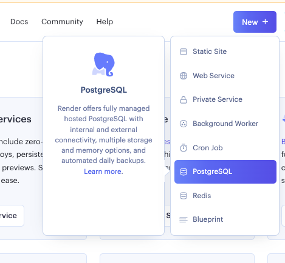
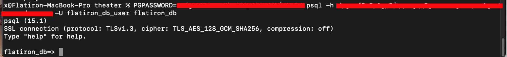
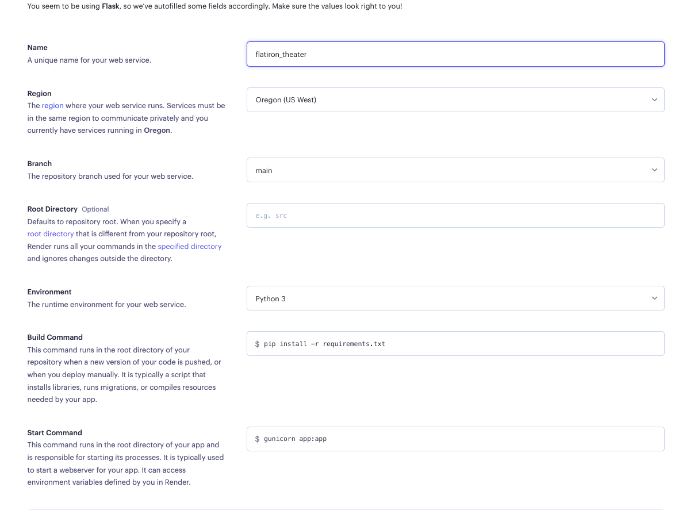

#  Deploying
## Learning Goals
* Demonstrate How to Deploy an Application Using "Render"
* Provide Step-by-Step Instructions That Students can Follow When Deploying Their Own Applications

# 📚 Review With Students: 
* Defining a Web Server 
* Application Environment 
    * Development vs. Testing vs. Production
* Picking a PaaS
    * Heroku
    * AWS
    * Digital Ocean
    * Render
 
# Set Up:
# PostgresSQL Installation (Mac)
  * `brew install postgresql`
  * `brew services start postgresql`
# PostgresSQL Installation (Windows)
  * `sudo apt update`
  * `sudo apt install postgresql-contrib libpq-dev`
  * `psql --version`
  * `sudo service postgresql start`
  * `whoami`
  * `sudo -u postgres -i`
  * `createuser -sr <your_user_name>`
  * `logout` to exit

### GitHub 
  1. ✅ On GitHub, create a new repository named flatiron_theater_deployment_<cohort_number>.

### Create a Local Repository
  2. ✅ Outside of the course repo, create a new local directory `mkdir theater_app`   
  * 2.1 Copy the solution code from the previous lecture into the new directory

### Configure Application 
  3. ✅ Add `python-dotenv` and `psycopg2-binary` to the pipfile    
  * 3.1 Create a requirements.txt with `pipenv requirements > requirements.txt`

### Render PostgreSQL
  4. ✅ Create an account on Render 
  * 4.1 Select 'New' and then PostgreSQL from the dropdown  
      
  * 4.2 Name your PostgreSQL database, and set the PostgreSQL Version to 15 (or newer). The region should auto-select. Verify you've selected the Free instance and click Create Database.

### Connect your local Database to Render 
  5. ✅ Navigate to your new Database from the Render Dashboard.    
  * 5.1 In the top right, select the connect dropdown. Select the External Connection Tab and copy the PSQL command. 
  *    
  * 5.2 Paste the command in your terminal.  
  * From here, you can run PSQL commands [PSQL command cheetsheet](https://postgrescheatsheet.com/#/tables)
  *   

### Commit your app to GitHub
 >Note: It’s a good idea to commit and deploy your project from the very beginning. Use GitHub to control and track your changes and use your deployment to verify your new features continue to will work once deployed.
 6. ✅ run `git init` in the local repo for your app.  
   * 6.1 Set your local repo to push to your Gethub repo `git add remote origin <github repo url>`
     > Note: If you need to change to a different Github repo use `git remote set-url origin <github repo url>`
   * 6.2 Push your code GitHub
   ```
    git add .
    git commit -m ‘first commit!’
    git push origin main 
   ```
### Create a new web service on Render
  7. ✅ From the render Dashboard, select 'New' and 'Web Service' from the dropdown menu
  * 7.1 Connect your repository 
  * 7.2 Name your Web Service and change the start command to `gunicorn --chdir server app:app`
  * 
  * 7.3. Click advanced and Add 2 Environment Variables 
     *  PYTHON_VERSION : <your python version>
     *  DATABASE_URI: <your render internal db url. However, replace postgres with postgresql>
  * Hit create and get a snack
  * Once deployed, the deployment url will be at the top Right of the the Web Service page. go to `<your url>/productions` to test your backend deployment. 